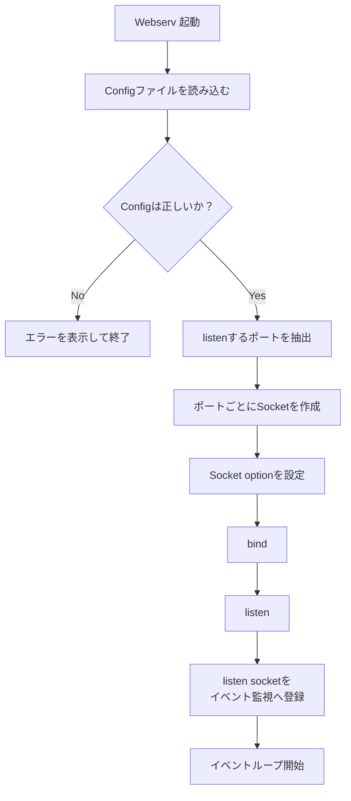

# Webserv Initialization Flow

Webservを起動してから、listen socketをイベント監視へ登録するまでの流れ。

## 補足

listen socketは、HTTP Requestを直接処理するsocketではない。

listen socketの役割は、新しいClient Connectionを受け付けること。
Clientから実際にデータを受信するためのsocketは、`accept()` によって別途作成する。
