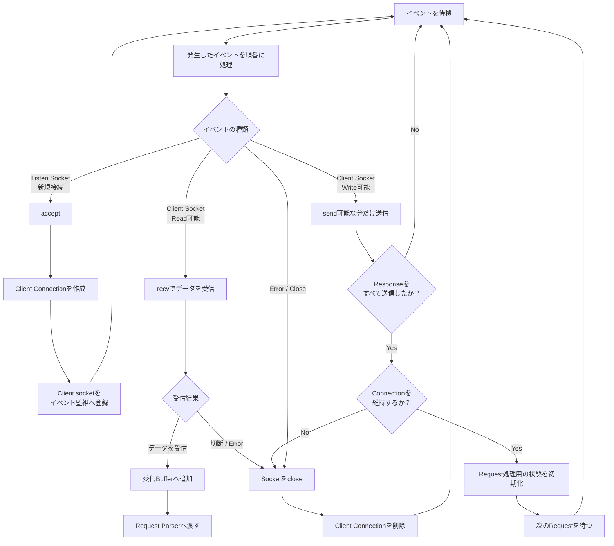

# Webserv Event Loop

イベント監視から返されたイベントを種類ごとに振り分ける流れ。

## 補足

イベントループでは、次のイベントを分離して扱う。

* listen socketへの新規接続
* Client socketからの読み込み
* Client socketへの書き込み
* 切断やエラー

`recv()` や `send()` を常に最後まで実行できるとは限らない。
non-blocking I/Oでは、処理可能な分だけ進めて、続きは次のイベントで再開する。
