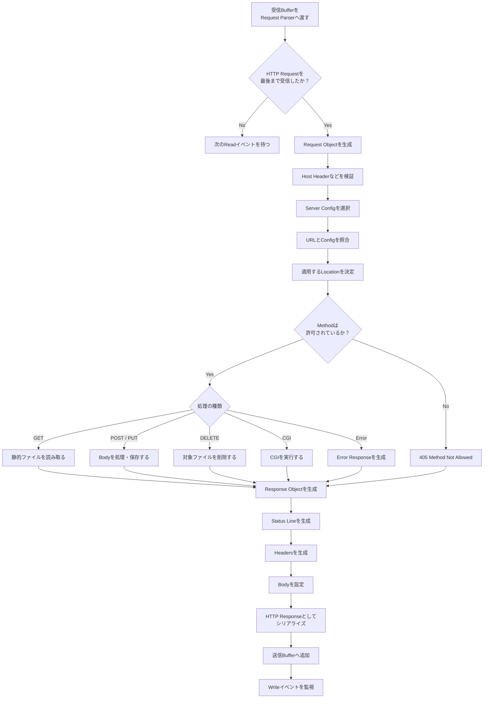

# HTTP Request and Response Flow

Clientから受信したデータを解析し、HTTP Responseを生成して送信Bufferへ追加するまでの流れ。

## 補足

この処理の責務は、ResponseをClientへ直接送信することではない。

HTTP処理側では、Responseをシリアライズして送信Bufferへ追加するところまで進める。
実際の `send()` は、Client socketが書き込み可能になったときにイベントループ側で行う。

これにより、巨大なファイルや通信速度が遅いClientにも対応しやすくなる。
