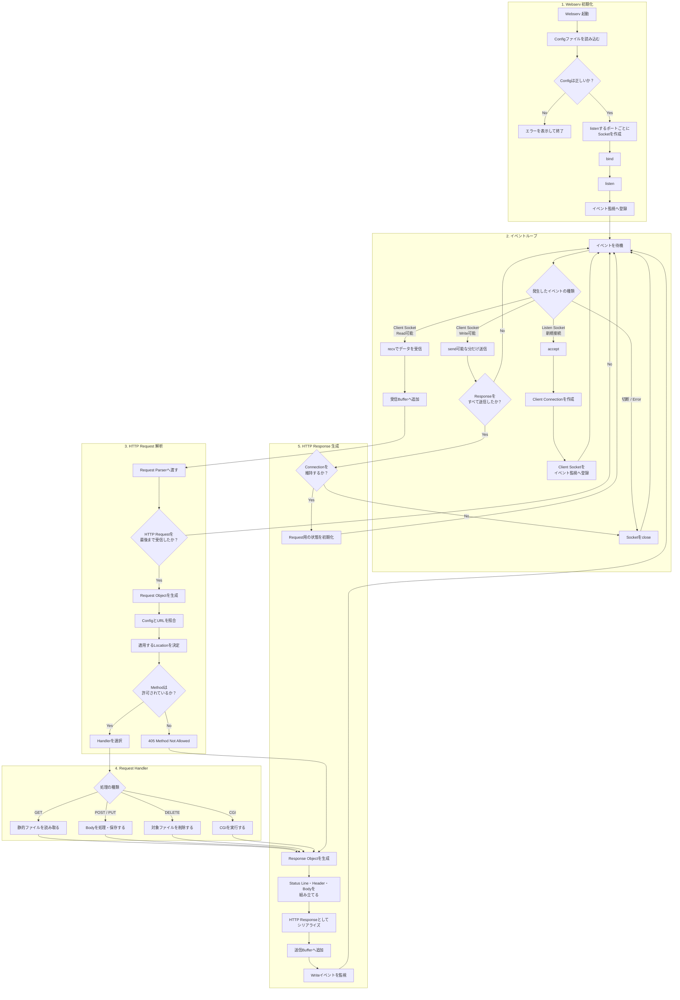

01_initialization.md
    イベントループ開始
            ↓
02_event_loop.md
    recv → 受信Bufferへ追加
            ↓
03_http_request_response.md
    Responseを送信Bufferへ追加
            ↓
02_event_loop.md
    Write可能イベント → send