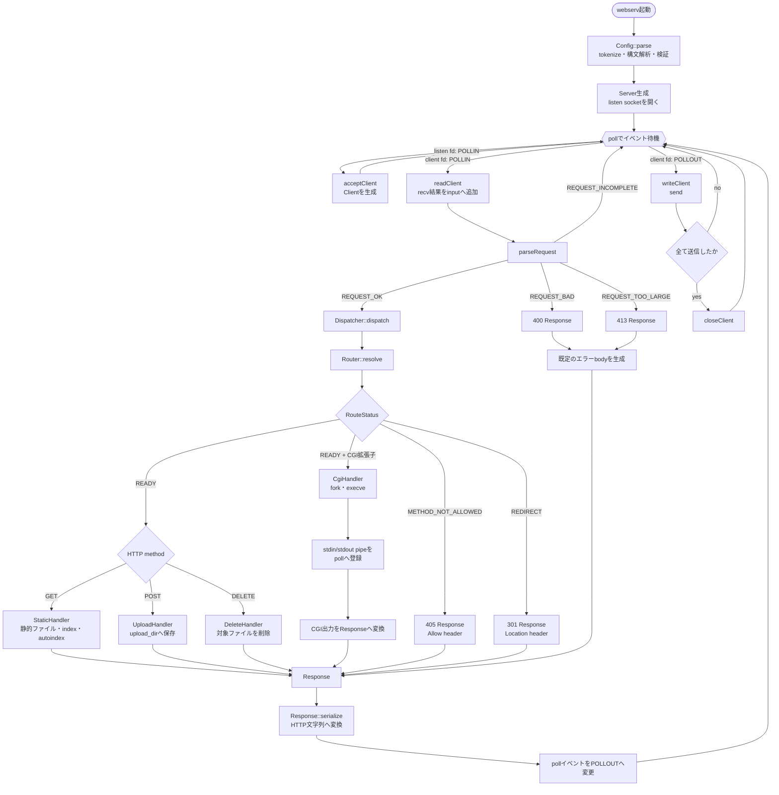
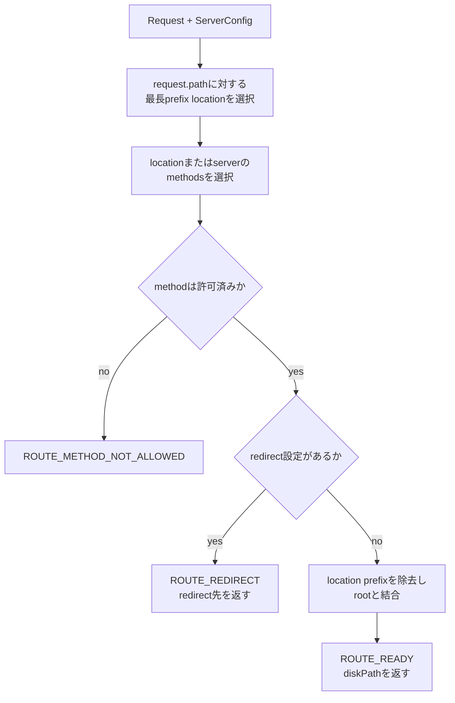
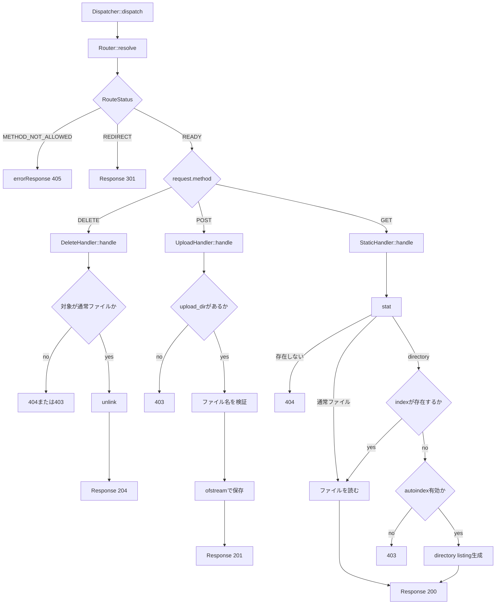
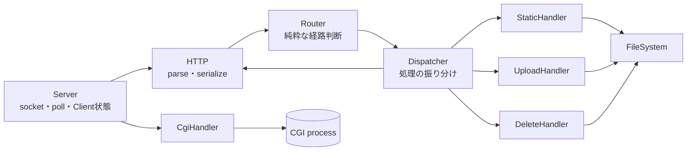
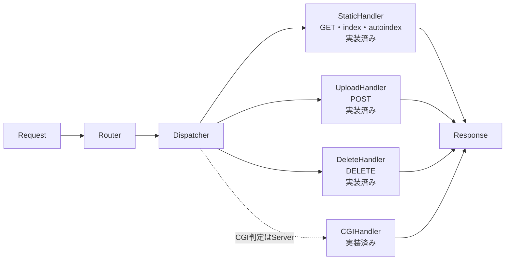

# 現在のリクエスト処理フロー

この文書は、現在のルート直下の実装がHTTPリクエストを受け取ってから、
レスポンスを返すまでの流れを示す。

## 全体像

## Routerの内部

`Router` は判断だけを行い、ファイル操作やレスポンス生成は行わない。

Routerの出力である`RouteResult`には次の情報が入る。

| フィールド | 内容 |
|---|---|
| `status` | 続行、405、redirectのいずれか |
| `location` | 選択されたlocation。server直下なら`NULL` |
| `methods` | 適用された許可method一覧 |
| `diskPath` | 静的ファイルなどが利用する実パス |
| `redirect` | redirect先 |

## DispatcherとStaticHandler

現在の`Dispatcher`はRouterの判断結果を受けてhandlerを選ぶ。
GET、POST、DELETEのfilesystem処理は各handlerへ分離済み。

## クラス間の責務

| モジュール | 現在の責務 | I/O |
|---|---|---|
| `Config` | nginx風block構文のtokenize、解析、検証、継承 | 設定ファイルを読む |
| `Server` | socket、poll、Client、timeout | socket I/O |
| `Http` | request解析、response直列化 | なし |
| `Router` | location、method、redirect、実パスの決定 | なし |
| `Dispatcher` | routing結果からhandlerまたはredirect/errorを選択 | なし |
| `StaticHandler` | GET、index、autoindex、MIME type | filesystem I/O |
| `UploadHandler` | POST bodyをupload directoryへ保存 | filesystem I/O |
| `DeleteHandler` | DELETE対象の検証と削除 | filesystem I/O |
| `CgiHandler` | CGI環境変数、fork/execve、CGI出力変換 | pipe I/OはServerのpollで管理 |
| `ResponseFactory` | custom error pageと既定error bodyの生成 | error pageを読む |

## 次のリファクタ後の目標

GET、POST、DELETEとCGIは各handlerへ分離済み。

Dispatcherは最終的に「どのhandlerを呼ぶか」だけを担当し、
各handlerが実際の処理と`Response`生成を担当する形を目指す。

## 現時点の重要な制約

- 1接続につき1リクエストを処理し、送信後に接続を閉じる。
- socketはnon-blockingだが、Dispatcher内のfilesystem処理は同期処理。
- CGI stdin/stdoutはnon-blocking pipeとしてsocketと同じpoll loopで管理する。
- CGIはlocationの`cgi_timeout`（既定30秒）でtimeoutし、504を返す。
- CGI出力は16 MiBを上限とする。
- Hostによるvirtual server選択はまだ行っていない。
- parse errorの400/413はDispatcherを通らず、Serverが生成する。

## 自動テスト

`make test`で次の4層を検証する。

| テスト | 固定する動作 |
|---|---|
| `ConfigTest` | block構文、継承、数値、重複、listen、redirect、CGI設定 |
| `RouterTest` | 最長prefix、実パス、method、redirect |
| `HttpTest` | incomplete、Host、body上限、chunked、serialize |
| `DispatcherTest` | static、autoindex、custom 404、upload、delete、405、redirect |
| `CgiHandlerTest` | 拡張子判定、CGI header/body変換、不正出力の500 |

`DispatcherTest`は`/tmp`にプロセス専用fixtureを作り、終了時に削除する。
プロジェクトの`www/`は変更しない。

`make integration-test`はCGIのGET・POSTと並行リクエストを実サーバーで検証する。
