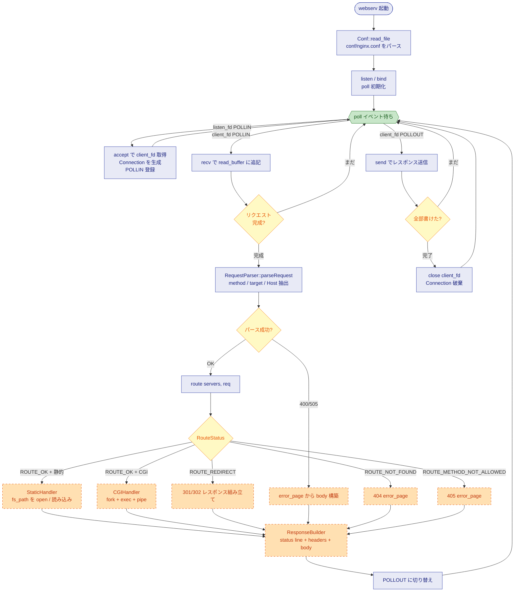
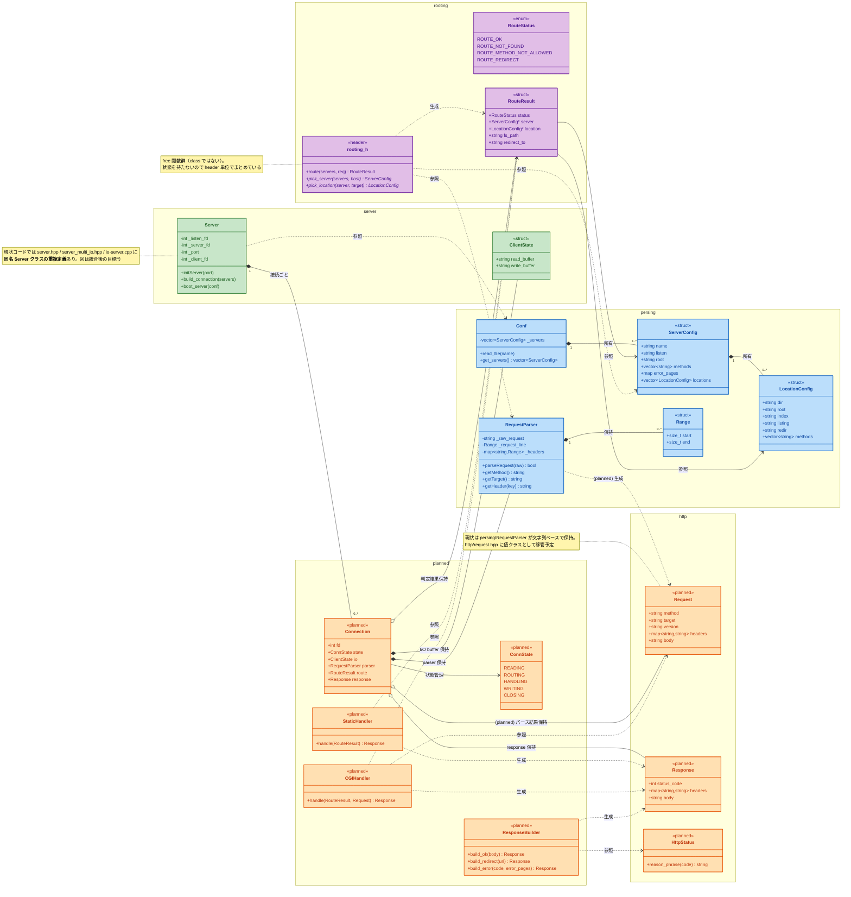

# webserv 設計図 — フローとデータ保持

このドキュメントは webserv の **全体構造** を 2 枚の Mermaid 図で表現する。

- **図 1 — リクエストライフサイクル**: 1 リクエストが受信から送信完了まで辿る経路（フローチャート）
- **図 2 — クラス図**: 各モジュールが何を保持し、何を参照するか（クラス図）

> 上位の責務分離（nginx と CGI/backend の境界）は [`architecture.md`](./architecture.md) を参照。

オレンジ点線 / `<<planned>>` は未実装モジュール。

> **本ドキュメントは「目標形」を描く**。現状コードとのギャップは下記「現状とのギャップ」セクションに集約。

---

## 図 1 — リクエストライフサイクル

> 多重 I/O は `poll()` で実装。subject は特定の方式（poll / select / kqueue / epoll 等）を強制しないので、当面 poll を維持する。

### 状態遷移として読むと

| フェーズ | poll が待つイベント | Connection の状態 | 何が増える |
|---|---|---|---|
| accept 後 | client_fd POLLIN | READING | ClientState (空 buffer) |
| 受信中 | client_fd POLLIN | READING | read_buffer に追記 |
| パース完了 | (同期処理) | ROUTING | RequestParser (Range が埋まる) |
| route 完了 | (同期処理) | HANDLING | RouteResult |
| handler 完了 | (同期処理) | WRITING | Response、write_buffer |
| 送信中 | client_fd POLLOUT | WRITING | write_buffer が減る |
| 送信完了 | — | CLOSING | (全破棄) |

---

## 図 2 — クラス図（何を保持するか）

> **色分け**: 青=persing（現状実装）／緑=server（現状実装）／紫=rooting（header 設計済み）／オレンジ=未実装 (`<<planned>>` 含む http も該当)

---

## 主な設計判断

| 判断 | 内容 |
|---|---|
| **`Connection` を導入する** (planned) | 今の `Server::ClientState` は read/write buffer のみ。これに `RequestParser` / `RouteResult` / `Response` / `ConnState` を集約して **「1 接続の生涯」を 1 つの構造で表現** |
| **`ConnState` enum** | 各接続が「次に何を待つか」を持つ必要があり、READING → ROUTING → HANDLING → WRITING の状態機械にする（多重 I/O の方式が poll でも他でも同じ思想） |
| **`rooting_h` は class でなく header 単位の関数群** | 状態を持たないので class にする意味がない。図上は `<<header>>` ステレオタイプでまとめる（実体は class ではない） |
| **`RouteResult` は `ServerConfig*` / `LocationConfig*` を持つ（値ではない）** | Conf 内の vector が真の所有者。routing は「指紋」を返すだけで複製しない（コピー回避 + 設定が単一の真実の源泉） |
| **handler は class、`ResponseBuilder` も class** | 状態は持たないが、責務が違うものは class でまとめて検索性を上げる（読者のため） |
| **`Connection.parser` は composition (`*--`)** | parser のライフサイクルは Connection と同じ。所有関係 |
| **`Connection.route` / `.response` は aggregation (`o--`)** | 状態によっては未生成（READING フェーズでは route も response もまだ存在しない） |
| **handler kind (static/CGI) は `RouteResult` に持たない** | CGI 判定は `fs_path` の拡張子で決まる（subject 仕様）。dispatch 層の責務、routing は知らなくていい |
| **HTTP 値クラスは `http/` に置く** | `Request` / `Response` / `HttpStatus` は http プロトコル層のもの。文字列 → 構造体の変換 (`RequestParser`) は `persing/` に残し、変換後の値オブジェクトを `http/` に集約 |

---

## 現状とのギャップ

図は **目標形**。現状コードとの主な差分：

| 図上 | 現実 |
|---|---|
| `namespace server` に `Server` 1 つ | `server.hpp` と `server_multi_io.hpp` で **同名 `Server` クラスが 2 重定義**。さらに `server.cpp` / `io-server.cpp` / `server_multi_io.cpp` の 3 ファイルが Server を実装（シンボル重複）|
| `poll イベント待ち` ノード | 実装と一致（poll ベース）。subject は多重 I/O 方式を強制しないため変更不要 |
| `Server` のメンバ `_listen_fd` / `_server_fd` 等 | 一致 |
| Server の Connection 保持 | **未実装**。現コードでは `boot_server` 内の local 変数 `std::vector<pollfd>` + `std::map<int, ClientState>` |
| `RequestParser` から `Request` 値クラス生成 | **未実装**。現状は `RequestParser` 内に文字列ベースで保持、`getMethod()` 等で都度返す |
| `http/` 配下の `Request` / `Response` / `HttpStatus` | **未実装**。`http/request.hpp/cpp` はプレースホルダ |
| `rooting_h` の関数群 | header は宣言済み (feat/routing) だが、`rooting.cpp` は現状スクラッチパッドの `main()` |
| handler / CGI / ResponseBuilder | **未実装**。現状は `server_multi_io.cpp` 内で `"Hello webserv\n"` ハードコード |

ファイル単位の現状は各ディレクトリの README に詳細：

- [`../prd/src/http/README.md`](../prd/src/http/README.md)
- [`../prd/src/persing/README.md`](../prd/src/persing/README.md)
- [`../prd/src/rooting/README.md`](../prd/src/rooting/README.md)
- [`../prd/src/server/README.md`](../prd/src/server/README.md)
- [`../prd/src/logging/README.md`](../prd/src/logging/README.md)

---

## 未解決の論点

1. **`Server` クラスの重複定義整理** — `server.hpp` か `server_multi_io.hpp` のどちらに統一するか
2. **`server.cpp` の構文エラー** (line 119 の `}` 抜け) — 修正後に重複定義整理
3. **`Connection` を `Server` の直接メンバ**にするか、`ConnectionPool` を切るか — 当面は直接メンバ（最小構成）
4. **CGI のタイムアウト / プロセス管理** — subject が要求する詳細は未確定。本図では CGIHandler の内部実装として隠蔽
5. **keep-alive / chunked transfer** — subject 範囲だが本図では明示せず。CLOSING ではなく READING に戻る枝が必要になる可能性
6. **`error_pages` の解決層** — 図では ResponseBuilder が担うが、`RouteResult` が候補パスを渡す案もある
7. **`RequestParser` を残すか、`http/Request` に統合するか** — 図では 2 つに分離（パーサと値クラス）。実装時に統合判断

---

## 関連ドキュメント

- [`architecture.md`](./architecture.md) — nginx vs backend の責務分離、subject 範囲外の明示
- [`../tmp/lab06_routing/README.md`](../tmp/lab06_routing/README.md) — routing の小型実験実装と設計判断
- 各ディレクトリの README（上記「現状とのギャップ」末尾参照）
