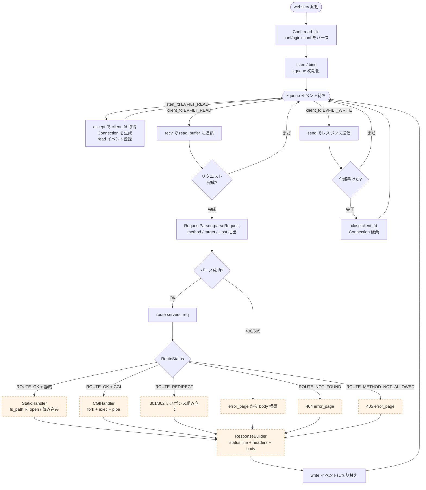
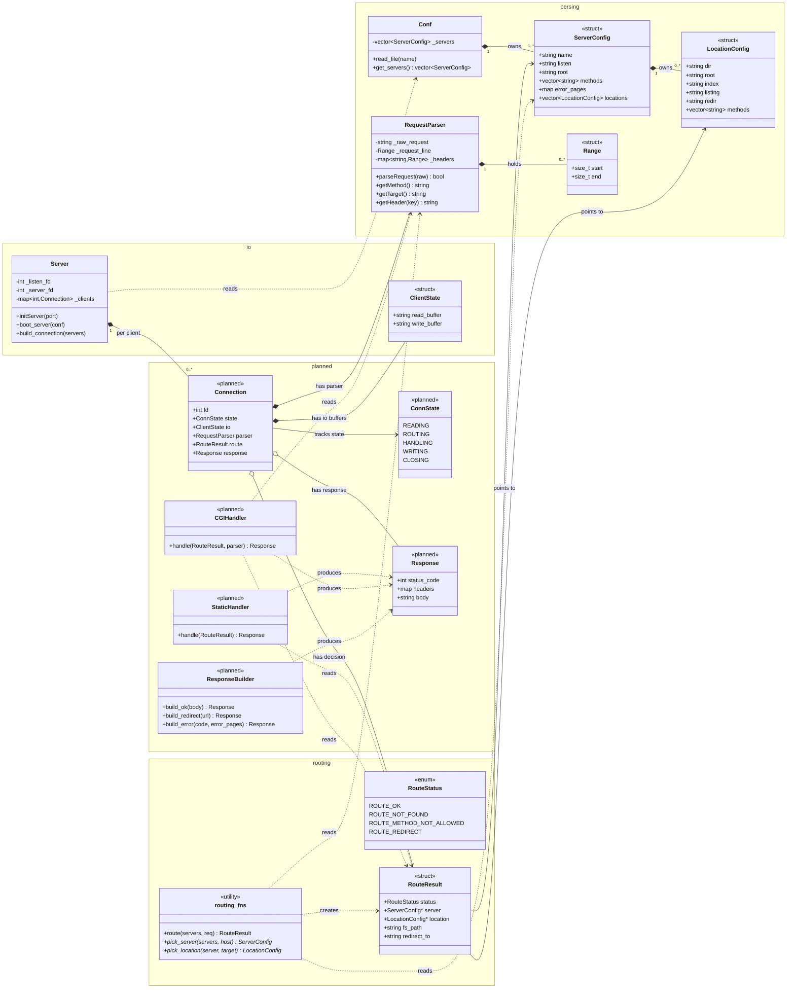

# webserv 設計図 — フローとデータ保持

このドキュメントは webserv の **全体構造** を 2 枚の Mermaid 図で表現する。

- **図 1 — リクエストライフサイクル**: 1 リクエストが受信から送信完了まで辿る経路（フローチャート）
- **図 2 — クラス図**: 各モジュールが何を保持し、何を参照するか（クラス図）

> 上位の責務分離（nginx と CGI/backend の境界）は [`architecture.md`](./architecture.md) を参照。学習ロードマップは [`../prd/src/rooting/LEARNING.md`](../prd/src/rooting/LEARNING.md) を参照。

オレンジ点線 / `<<planned>>` は未実装モジュール。

---

## 図 1 — リクエストライフサイクル

### 状態遷移として読むと

| フェーズ | kqueue が待つイベント | Connection の状態 | 何が増える |
|---|---|---|---|
| accept 後 | client_fd EVFILT_READ | READING | ClientState (空 buffer) |
| 受信中 | client_fd EVFILT_READ | READING | read_buffer に追記 |
| パース完了 | (同期処理) | ROUTING | RequestParser (Range が埋まる) |
| route 完了 | (同期処理) | HANDLING | RouteResult |
| handler 完了 | (同期処理) | WRITING | Response、write_buffer |
| 送信中 | client_fd EVFILT_WRITE | WRITING | write_buffer が減る |
| 送信完了 | — | CLOSING | (全破棄) |

---

## 図 2 — クラス図（何を保持するか）

---

## 主な設計判断

| 判断 | 内容 |
|---|---|
| **`Connection` を導入する** (planned) | 今の `Server::ClientState` は read/write buffer のみ。これに `RequestParser` / `RouteResult` / `Response` / `ConnState` を集約して **「1 接続の生涯」を 1 つの構造で表現** |
| **`ConnState` enum** | kqueue は edge-triggered。各接続が「次に何を待つか」を持つ必要があり、READING → ROUTING → HANDLING → WRITING の状態機械にする |
| **`routing_fns` は class でなく namespace 表現** | 状態を持たない関数群。class にする意味がない（cf. `LEARNING.md`） |
| **`RouteResult` は `ServerConfig*` / `LocationConfig*` を持つ（値ではない）** | Conf 内の vector が真の所有者。routing は「指紋」を返すだけで複製しない（コピー回避 + 設定が単一の真実の源泉） |
| **handler は class、`ResponseBuilder` も class** | 状態は持たないが、責務が違うものは class でまとめて検索性を上げる（読者のため） |
| **`Connection.parser` は composition (`*--`)** | parser のライフサイクルは Connection と同じ。所有関係 |
| **`Connection.route` / `.response` は aggregation (`o--`)** | 状態によっては未生成（READING フェーズでは route も response もまだ存在しない） |
| **handler kind (static/CGI) は `RouteResult` に持たない** | CGI 判定は `fs_path` の拡張子で決まる（subject 仕様）。dispatch 層の責務、routing は知らなくていい |

---

## 未解決の論点

1. **`Server` クラスが 2 つある** (`server.hpp` と `server_multi_io.hpp`) — 多重 I/O 版に統一する前提。図は統一後の姿
2. **`Connection` を `Server` の直接メンバ**にするか、`ConnectionPool` を切るか — 当面は直接メンバ（最小構成）
3. **CGI のタイムアウト / プロセス管理** — subject が要求する詳細は未確定。本図では CGIHandler の内部実装として隠蔽
4. **keep-alive / chunked transfer** — subject 範囲だが本図では明示せず。CLOSING ではなく READING に戻る枝が必要になる可能性
5. **`error_pages` の解決層** — 図では ResponseBuilder が担うが、`RouteResult` が候補パスを渡す案もある

---

## 関連ドキュメント

- [`architecture.md`](./architecture.md) — nginx vs backend の責務分離、subject 範囲外の明示
- [`../prd/src/rooting/LEARNING.md`](../prd/src/rooting/LEARNING.md) — routing 層の学習ロードマップ
- [`../tmp/lab06_routing/README.md`](../tmp/lab06_routing/README.md) — routing の小型実験実装と設計判断
